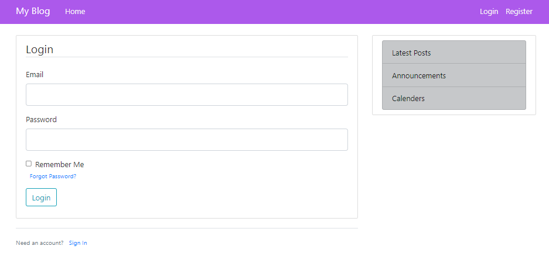

# Web and Mobile


## TasksApi 

## My Flask Blog

### Main Features of the Flask Blog

Users are able to:

* Login into existing account

  
  
* Register for a new account

  
  
* View existing posts 

  
  
* Create a new post 

  
  
* View Profile Page of current user and other users
  
  The current user will also be able to follow other users pages
  
  

  
* Update and Delete posts created


### Security 

#### Protecting Users' Passwords
In ensuring the protection of users' passwords, aside from the Werkzeug library which was used at first, Bcrypt was applied in examining different options for hashing passwords.

```python 
...
hashed_password = bcrypt.generate_password_hash(form.password.data).decode('utf-8')
...
```

#### Forget User Password

In the event that a user forgets the password for his profile, they are able to reset their password by a link with a generated token being sent to their email. 

 
 
 
 
 
